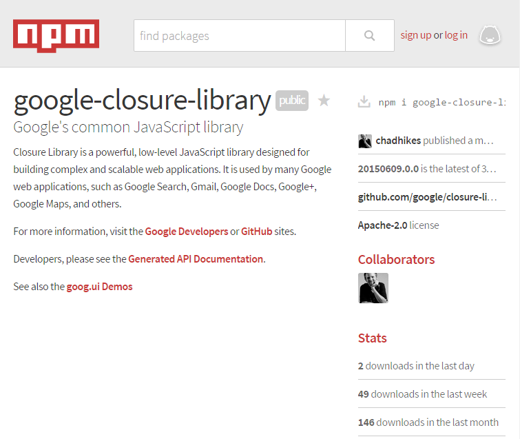

<!--
Execute this vim command to push updates of this file:

:execute "!" . expand('%:p:h') . "/update.sh"
-->

# daily-commits

GitHubのPublic Contribution Mapをどうしても途切れさせたくないために、毎日、OSSに何らかの形で寄与するか、何かしら技術を磨いたりブログ書いたりしたら更新する。
実際にコミットした日と日記の日付が必ずしも一致しない点はご容赦を。

# 2015-08-08

表参道.rbのスライドづくりで中断していたkeep-me-contributingの開発を再開。

# 2015-08-06

[表参道.rb #4にて発表](http://the.igreque.info/slides/2015-08-06-trivial-optimization-in-ruby.html)。  
[説明に使ったサンプルコード](https://github.com/igrep/igreque.info/blob/master/prgs/2015-08-06-compare-trivial-codes.rb)はこちら。

残念ながらスライドが中途半端になってしまったものの、
思ったより受けが良くてよかったよかった。

# 2015-08-03 - 2015-08-06

表参道.rb #4 向けのスライド作成中。

# 2015-08-02

今度はClosure Compilerと格闘するも、`import`が思うようにcompileされず、
closure-libraryがまるまる含まれて肝心のアプリのファイルが含まれないという残念なcompile結果が吐かれてしまう。  
[どうやら、ES6のimportを使用しているファイルは、ちゃんとcompileしてくれないらしい。](https://github.com/google/closure-compiler/issues/880)
やっぱり`goog.provide`と`goog.require`を使ってやるしかしかないらしい。  
ここまで何自分はつまらないところでハマっているんだろう。馬鹿みたいだ。  
普通に普通の作り方をしていればこんなことで時間を無駄にすることはなかったろうに...。  

# 2015-08-01

mochaやらclosure-libraryのXhrIoやらgoog.domやらと何時間も格闘した結果、
node.js上でのテストはどうもうまく行かないということがよくわかった。  
GitHubから取得したSVGをパースする部分で、
どうしてもブラウザのAPIを使わなければならないらしいことがわかった。  
`jsdom`やら`xmlhttprequest`やら`xmldom`やらいろいろ使ってエミュレーションしてみたものの、
うまく行かなかった。

何か他によい方法がある気がするが、どうせもともとブラウザ向けに
Closure Compilerを使うつもりだったので、babelも使わず、
シンプルにClosure Compilerとbrowserifyでビルドしたものをブラウザで読むようにしようと思う。  
ただ、browserifyが本当にあったほうがよさそうなのはpower-assertだけなので、
closure-libraryと同様、`node_modules`から`lib`以下にcopyする、という作戦でも良いかも。

# 2015-07-29

昨日見つけたSVGからcontribution mapの状態を取得するクラスの設計を検討。

# 2015-07-28

GitHubのEvents APIが自分の思っていた、contribution mapの状態を取得できるものではないことに気づいてしまったorz。  
https://github.com/igrep/keep-me-contributing/issues/1

とりあえず、サポートにfeature requestはしたけど。。。  
ひとまず、[プロフィールページ](https://github.com/igrep)から直接取得することを検討。  
調べたところ、どうやら例のcontribution mapを描いたSVGを直接取得するURlがあるらしい。

# 2015-07-27

次回表参道.rbで発表する資料のアウトラインを検討。  
後もちろんclosure-libraryの勉強。

# 2015-07-26

keep-me-contributing, GitHubのEvents APIのresponseから最新のContribution日時を取得する処理まで実装。  
次はAPIクライアントと組み合わせなきゃ。

# 2015-07-25

ついにここひと月近く書いていた[ポエムめいたもの](http://the.igreque.info/posts/2015/1-predictable-programming.html)
の第一弾を公開した。

幸いHaskellもくもく会の途中だったので周りのメンバーから反応をいただけた。  
反応はまずまずで、どうもこれから続きを見ないとわからない、と言った様子で、続きを早く書くことへのプレッシャーを感じた。

あと、[自分がいかに証明関係のことをわかっていないかよくわかった](https://twitter.com/mandel59/status/624848902865317888)のも大きい。  
それ含めて、やっぱり勉強会では自分の力不足を思い知るなぁ。

# 2015-07-24

2015-07-22に書いたテストケースをパス。  
初めてClosure Libraryの機能を使ってみた。といってもわざわざClosure Libraryでなくてもよさそうな`goog.array.find`だけど。  
Babelが提供するES6の`import`では`goog`をうまく`import`出来なかったのが残念。  
まぁしょうがないか。。。

# 2015-07-23

Closure LibraryやClosure Compilerのドキュメント読んでた。  
Closure Libraryはともかく、Closure Compilerは意外と公式のドキュメントがWeb上にないのが辛い。
`--help`実行したらいっぱい出てきたので明日からそっちも読む。

# 2015-07-22

昨日書いたテストケースをクリアするコードを書き、更に失敗するテストを追加。  
恐ろしく基本に忠実な（はずの）TDDを恐ろしくゆっくりやってる。

# 2015-07-21

今日は失敗するテストを書くことだけした。何もハマらずにできてよかった。  
ついでにGitHub API用のModuleについて調べてみたが、まだ私が使いたいAPIをサポートしていなかった。  
話が充分に単純なので、自前でやったほうが楽だしClosure Libraryの勉強になる気がしてきた。  
どうせOAuthを使わないといけないほど頻繁にアクセスすることもないだろうし。

# 2015-07-20

テストコードを逐一Closure Compilerでビルドするのはテストコードでトライアルアンドエラーをする上で効率が悪いだろうと思い、
敢えてテストコードにはbabelを使うことにした。  
[ぼくのかんがえたさいきょうのES6プロジェクトテンプレート](http://qiita.com/mohayonao/items/9b0655b8b4979bffda31)に書いてあった方法が割とお手軽そうだったのと、
どうしても`function`キーワードをmochaで書きたくなかったため。

index.jsがなければ正しくimportしてくれない、という事実に気づくまでに超絶ハマってしまい、結局超夜ふかししてしまった。  
eslintの設定が思いの外わかりづらく、ES6のmoduleを認識させるまでに時間がかかったせいもある。

そしてやってから気づいたのだが、型チェックはテスト書いてる時もして欲しいし、別途検討する必要があるなぁ。

# 2015-07-19

Closure Libraryをどう入れるか悩んだ。ブラウザで使うライブラリなのだからbowerがいいだろう、
と思って[コピーしているリポジトリ](https://github.com/components/closure-library)を見つけるも、どうも一度cloneして以降全く更新されてないらしい...。  
悩んだ挙句、まぁ、趣味でclosure-libraryを使う機会は今後そうないだろう、と思い、
まだちゃんと更新されているらしい[npmから持ってきたもの](https://www.npmjs.com/package/google-closure-library)を
grunt-contrib-copyでブラウザ向けのJSのディレクトリにcopyする、というなんだかダーティなやり方をとることにした。  
webpackとかを使うという手もあったかもしれないけど二重に同じようなものを入れるのもなんだかなぁ、
どうせ`require`しないといけないのはclosure-libraryだけっぽいしなぁ、と思ったので。

あと、viewをどうするかまた悩み、templateライブラリも探してみたものの、closure-templateはなんだか文法が好きになれそうもなく、
どうせ小さなプロジェクトだし、これ以上学習コストばかり上げてなかなか一番やりたいService Workerに辿りつけないのも残念なので、
[closure-libraryのチュートリアル](https://developers.google.com/closure/library/docs/tutorial)に従って直接domを組み立てる方針に。  
間違いなくある程度大きくなったら死ねるのでその時はReactかelm-htmlかなんかで。  
closure-libraryなんて使っておいて今更だけど、Androidでも動かす予定なのに大丈夫なんだろうか...。

P.S.

例の[npmから持ってきたclosure-library](https://www.npmjs.com/package/google-closure-library)を改めて見たら、
「2 downloads in the last day」となっていた。  
それ、間違いなく私です...。



# 2015-07-18

前々から作ろうと思っていた、[GitHubのContribution Mapを埋める何かをしたか確認するツール](https://github.com/igrep/keep-me-contributing)に着手。  
chrome-mysql-adminの時とは打って変わってスクラッチからJSプロジェクトを作り始めたため、
ディレクトリ構成やビルドツール、Closure Toolsとどう合わせて使うかなどでめちゃめちゃ悩んでしまい、
そのへんの整備だけで1日費やしてしまった。  
特に迷ったのがビルドツールで、[Grunt/Gulpで憔悴したおっさんの話](http://t32k.me/mol/log/npm-run-script/)なんて聞いたり、
[npm で依存もタスクも一元化する](http://qiita.com/Jxck_/items/efaff21b977ddc782971)なんて聞いたり、
他にも諸々の整備で頭がごちゃごちゃになったりで、1つ1つ進めるのにかなり時間がかかってしまった。  
結局、上記のJxck\_さんのやりかたを参考にしつつ、可能な限りgrunt-shellで諸々のタスクをやる構成にした。  
Closure CompilerやClosure Libraryの組み込みなど、まだまだやることは多い。

# 2015-07-17

- [chrome-mysql-adminにgrunt-ng-annotateを追加したPull Request](https://github.com/yoichiro/chrome_mysql_admin/pull/34)を送った。

# 2015-07-16

- ようやくgrunt-ng-annotateを既存のGruntfileに組み込めたっぽい。ちゃんと動くのか、確かめ方がいまいちわからないのが辛い。
- 引き続き[ポエムっぽいもの](https://github.com/igrep/igreque.info/blob/master/posts/2015/1-predictable-programming.mkd)も電車で進めた。

# 2015-07-15

- [このへん](http://gruntjs.com/configuring-tasks#files)を参考に、`grunt-ng-annotate`に与えるオプションをどうするか考え中。
- [ポエムっぽいもの](https://github.com/igrep/igreque.info/blob/master/posts/2015/1-predictable-programming.mkd)も電車で進めた。

# 2015-07-13 - 2015-07-14

- [ポエムっぽいもの](https://github.com/igrep/igreque.info/blob/master/posts/2015/1-predictable-programming.mkd)を更に進めた。  
  書き溜めたものをまとめてコミットしたってところ。

# 2015-07-12

- [On Understanding Data Abstraction, Revisited](http://www.cs.utexas.edu/~wcook/Drafts/2009/essay.pdf)読了。  
  本当に対立しているのは関数型プログラミング対オブジェクト指向プログラミングじゃなくて代数的データ型対オブジェクトなんだなぁということがよくわかった。  
  実際には多くの言語が折衷的な方法をサポートしているみたいだけど。
- 単純に`Gruntfile`の書き方をちゃんと理解していないだけだった。。。とりあえず動くようにはしたけど出力結果が明らかにおかしい。  
  やっぱりコピペで挑むのは辛いなぁ。

# 2015-07-11

- やっぱり[ng-annotate](https://github.com/olov/ng-annotate)を入れるのを優先してやることに。すぐ導入でき、効果も高そうなので。
    - しかし、なぜか`grunt ngAnnotate`しても`No "ngAnnotate" targets found.`と言われてしまう。  
      `grunt --help`見る限り`ngAnnotate`もリストアップされてるんだけど...。

# 2015-07-10

- chrome-mysql-adminにテーマ機能実装中。新しくテーマの変更を伝達させるためのServiceを作ったので後はどこかからそれをlistenしてCSSに反映させればとりあえず欲しい機能はできるだろう。  
  どのControllerで反映させるのがよいか、というのは依然問題だけど...。
- [ng-annotate](https://github.com/olov/ng-annotate)なるAngularJSでの開発必携っぽいパッケージを見つけたので次かその次のPRで入れよう。テスト書くのとどっちさきかなー。

# 2015-07-09

- <a href="http://www.amazon.co.jp/gp/product/B00EESW7JQ/ref=as_li_ss_tl?ie=UTF8&camp=247&creative=7399&creativeASIN=B00EESW7JQ&linkCode=as2&tag=poe02-22">Effective JavaScript</a>をもう少しで読み終える。
    - 中盤知ったところが続いてあまり面白くなかったが、最後の並列処理の話がなかなか面白い。
      まぁ、Promiseとか代替手段が出来た今は活かす機会はあまりないかもしれないけど、Promiseを使わないでこの本に書いてあるようなテクニックで書かれたコードを目にする機会があるかもしれないし、覚えておこう。
    - 最初の方のところでいろいろおもしろい罠をたくさん知ったけど、ぱっと思い出せないので読み返したい。
- [よういちろうさんの指摘](https://github.com/yoichiro/chrome_mysql_admin/pull/31#issuecomment-119781173)を受けて修正。眠い中夢中になってやったらしょうもないミスをしてたw

# 2015-07-08

AngularJSの勉強をちょっと。業務が忙しくてほぼ何もできず。。。

# 2015-07-07

- chrome-mysql-adminにテーマ機能実装中。
- Chromebook上のDebianにchrome-mysql-adminの開発環境を整えようとするも、chroot環境の制約上、systemctlからmysqldが動かせないことが発覚。  
  やむを得ず以前からやってるEC2上に開発環境を整えるのを再開し、そこでmysqldを立ち上げる方向で検討する。  
  ただ、ググったところ[手動では起動できる](https://github.com/dnschneid/crouton/issues/73)ことがわかったので、とりあえずはそれでよさげ。

# 2015-07-06

chrome-mysql-adminにテーマ機能を付ける方法を検討中。  
[よういちろうさんの「オレ流AngularJSを使った設計ポリシー」](https://www.eisbahn.jp/yoichiro/2014/10/my_angularjs_design_policy.html)に従い、
テーマの変更を表すイベントを作り、それをLoginFormControllerなりConfigurationDialogControllerなりから`$rootScope`経由で伝えるのがよさそう。
問題はどのControllerからテーマをviewに伝えるか。  
恐らく新しいControllerを作ってそこからCSSのクラスをbodyなどに設定すれば良いと思うが、DOMのルートに近い要素に関わる変更なので、
ルートっぽいところを操作する名前がよいのか、それともテーマのみを操作するような名前がよいのか。  
前者の場合、他のControllerの親みたいな扱いにしないといけないのか。

# 2015-07-05

- chrome-mysql-adminの開発環境をChromebookにも。今度のTrifortでやるもくもく会に備えて。
- [ポエムっぽいもの](https://github.com/igrep/igreque.info/blob/master/posts/2015/1-predictable-programming.mkd)の続きを少し。

# 2015-07-04

風邪で寝こみつつ、<a href="http://www.amazon.co.jp/gp/product/B00EESW7JQ/ref=as_li_ss_tl?ie=UTF8&camp=247&creative=7399&creativeASIN=B00EESW7JQ&linkCode=as2&tag=poe02-22">Effective JavaScript</a>をちょっとだけ読んだ。

# 2015-07-02

chrome-mysql-adminに、今度は接続設定ごとにテーマを設定する機能をつけるため、[ブランチを作成](https://github.com/igrep/chrome_mysql_admin/tree/theme-spike)。  
本番環境用やステージング用で色を変えられるといい、というニーズがあるので。

# 2015-07-01

[ポエムっぽいものを書き始めてみた](https://github.com/igrep/igreque.info/blob/master/posts/2015/1-predictable-programming.mkd)。  
あいにくの遅筆なんで書くのは時間かかりそうだけど...。  
なるべく具体的な例をたくさん出してポエム「っぽいもの」、つまり文章はポエムだけど中身はポエムらしからぬものにしていきたい。

# 2015-06-30

Sent pull request: https://github.com/yoichiro/chrome_mysql_admin/pull/31

# 2015-06-29

Sent pull request: https://github.com/yoichiro/chrome_mysql_admin/pull/30

# 2015-06-28

Angluar.jsの勉強をしつつchrome-mysql-adminのソースを読んでる。

# 2015-06-27

[第21回Haskellもくもく会](http://haskellmokumoku.connpass.com/event/15808/)にてLambdaConf 2015中にチャレンジして以降放置していたItamaeを利用したEC2での開発環境づくりに挑戦。  
Dropboxの設定まで出来て概ね満足。Haskell関連はstackを入れるだけに留まったけど。。。

# 2015-06-26

chrome-mysql-adminのGruntfile.jsをいじり、livereloadなしでも自動的にreloadできるようにした。  
Linuxだとlivereloadは使えないらしく、辛い。

# 2015-06-25

chrome-mysql-adminの修正に向けて、ひとまずChromeアプリの基本から。デバッグできるよう環境整備。  
メインマシンのVMにはchromeをインストールしていなかったのだが、やっぱりやりづらそうなので入れることに。  
GUIアプリの開発は今後も課題だなぁ。

# 2015-06-24

- chrome-mysql-adminに更にPR: [yoichiro/chrome_mysql_admin/pull/27](https://github.com/yoichiro/chrome_mysql_admin/pull/27)

# 2015-06-23

- chrome-mysql-adminの環境整備。package.jsonをいじって適当にバージョンあげたら例のエラーがなくなった。もう遅いのでPRはまた明日...。
    - 1つ送った: [yoichiro/chrome_mysql_admin/pull/27](https://github.com/yoichiro/chrome_mysql_admin/pull/27)
- 会社の環境にも`grunt`コマンドをインストール。`npm install -g grunt-cli`すればよかったのね。
- ホッとしつつchrome-mysql-adminのディレクトリで`grunt`を実行するもまたエラー... どうもproxyをうまく扱えていないらしい。proxyを解除したら接続できた。

    ```
    Running "bower:install" (bower) task
    /home/yu/Dropbox/prg/foreign/chrome_mysql_admin/node_modules/grunt-contrib-compass/node_modules/tmp/lib/tmp.js:261
      throw err;
              ^
    TypeError: Request path contains unescaped characters.
        at new ClientRequest (_http_client.js:73:11)
        at TunnelingAgent.exports.request (http.js:49:10)
        at TunnelingAgent.createSocket (/home/yu/Dropbox/prg/foreign/chrome_mysql_admin/node_modules/grunt-bower-task/node_modules/bower/node_modules/request/node_modules/tunnel-agent/index.js:117:25)
        at TunnelingAgent.createSecureSocket [as createSocket] (/home/yu/Dropbox/prg/foreign/chrome_mysql_admin/node_modules/grunt-bower-task/node_modules/bower/node_modules/request/node_modules/tunnel-agent/index.js:184:41)
        at TunnelingAgent.addRequest (/home/yu/Dropbox/prg/foreign/chrome_mysql_admin/node_modules/grunt-bower-task/node_modules/bower/node_modules/request/node_modules/tunnel-agent/index.js:80:8)
        at new ClientRequest (_http_client.js:154:16)
        at Object.exports.request (http.js:49:10)
        at Object.exports.request (https.js:136:15)
        at Request.start (/home/yu/Dropbox/prg/foreign/chrome_mysql_admin/node_modules/grunt-bower-task/node_modules/bower/node_modules/request/request.js:584:30)
        at Request.end (/home/yu/Dropbox/prg/foreign/chrome_mysql_admin/node_modules/grunt-bower-task/node_modules/bower/node_modules/request/request.js:1212:28)
    ```


# 2015-06-22

- 空き時間に会社のPCにもchrome-mysql-adminを開発する環境を整えようとするも、今度は`npm install -g`したはずのgruntの実行ファイルが見当たらない。findコマンドでも全然ヒットしなかった。自宅ではpacmanで入れたからだろうか？しかし昨日はそれでエラーになったぽいんだけど...。どこで入れるのがいいんだ...。

# 2015-06-21

- 社内LT大会の資料完成。
- 仕事で使うかもしれなくなったので<a href="http://www.amazon.co.jp/gp/product/4873117097/ref=as_li_ss_tl?ie=UTF8&camp=247&creative=7399&creativeASIN=4873117097&linkCode=as2&tag=poe02-22">Serverspecの本</a>を一昨日から購入して読んでる。割と読みやすくてこれなら1周間もかからないだろう。
- 前から気になっていた[Chrome MySQL Admin](https://github.com/yoichiro/chrome_mysql_admin)をfork。これを私のフロントエンド道の第一歩にしたい。
    - まだnpmもbowerもgruntも入れてなかったので両方共`sudo npm install -g`した。globalにインストールするからsudoが要るのね...。
    - `grunt`してみるも`Fatal error: Arguments to path.join must be strings`なるエラーが出て辛い。どうやら依存しているツール群のバージョンが古いのが問題らしい。オプションでスタックトレース出したり出来ないのかな...。

# 2015-06-20

社内LT大会の資料作り、と言いつつQiita記事書く。結局またRuby、しかもRSpecなんですけどね。

# 2015-06-19

- beatupのテストがだいたい書け、だいたいアイディアのプロトタイプになるようなコードは書けた。  
  例外や結果の扱いなど、まだまだ実際にリリースする前に考えるべきケースはあるものの、一旦放置したい。  
  なんだか他のことをしたくなった。Rubyに飽きた飽きたと言いつつ結局書いてるのも悲しい。

# 2015-06-16 - 2015-06-18

- beatupのテストを書いてる途中。

# 2015-06-15

- beatupのテストを書いてる途中。
- [googleauthというgemに小さなPull Request](https://github.com/google/google-auth-library-ruby/pull/30)
- [Lens&Prism勉強会まとめ記事における、誤った表現の修正](https://github.com/igrep/igreque.info/commit/0ecae48777ec73ae948710bd0420568f9d723f3a)

# 2015-06-14

- beatupのテストを書いてる途中。

# 2015-06-13

- beatupのテストを書いてる途中。
- みなとRuby会議02 スピーカーへの応募。

# 2015-06-12

- [LambdaConf 2015私的まとめの日本語訳](http://the.igreque.info/posts/2015-06-12-lambdaconf-ja.html)完成。
    - それに合わせて英語版も微修正。

# 2015-06-10 - 2015-06-11

- LambdaConf 2015私的まとめの日本語訳
- 仕事で使うことになった[legato](https://github.com/tpitale/legato)にいくつかIssueやPRを送った。相変わらずしょうもないところだけど。。。
    - [Correct weird use of lambda](https://github.com/tpitale/legato/pull/96)
    - [Correct numbering by indenting code blocks](https://github.com/tpitale/legato/pull/95)
    - [Why not Legato::User#segments and Legato::User#goals?](https://github.com/tpitale/legato/issues/97)
    - [add Legato::User#segments and Legato::User#goals](https://github.com/tpitale/legato/pull/98)

# 2015-06-09

- [Lens&Prism勉強会私的まとめ完成](http://the.igreque.info/posts/2015-06-09-lens-prism.html)

# 2015-06-08

- 引き続きLens&Prism勉強会私的まとめ
- [全角アルファベットやひらがな・カタカナを入力しても（ちょっと）いい感じに解釈してくれるvimrc](http://qiita.com/igrep/items/2c0dae6242eed5baf172)を書き、[そこからふらっと思いついたvimプラグイン](https://github.com/igrep/sokuon.vim)を作ってみるも、動かんorz。

# 2015-06-06 - 2015-06-07

- Lens&Prism勉強会私的まとめ

# 2015-06-05

- 表参道.rb #1 にて発表時に気づいた諸々の修正など。

# 2015-06-04

- [表参道.rb #1 にて発表](http://the.igreque.info/posts/2015-06-04-omotesandorb.html)。

# 2015-06-03

- [Finished writing entry about LambdaConf 2015 (in English)](http://the.igreque.info/posts/2015-05-26-lambdaconf-en.html).
- 表参道.rb #1 のLTの資料作り。

# 2015-06-02

- Still writing entry about LambdaConf 2015.
- Reported issue: https://github.com/azu/github-reader/issues/5

# 2015-05-31 - 2015-06-01

Still writing entry about LambdaConf 2015.

# 2015-05-30

Lens&Prism勉強会に出席。  
この手の勉強会は自分の興味に合う発表がなかなかなく、発表したほうが面白いことが多いと感じていたが、
今回は流石にトピックを絞っただけであってか、面白かったし楽しかった。  
感想エントリ書いてる暇あるか？

Still writing entry about LambdaConf 2015.

# 2015-05-26 - 2015-05-29

Writing entry about LambdaConf 2015.

# 2015-05-25

predefを完成させた。あとは適当なタイミングでリリースするだけ。
Writing entry about LambdaConf 2015.

# 2015-05-24

LambdaConf 2015 Day 3 today! I took part in these activities and workshops:

- Hiking (lot of fun!)
- Write Adventure Game in Elm.


# 2015-05-23

Haskell環境をAWSに構築するスクリプト作成中。
itamaeのrecipe.rbを作成。

LambdaConf 2015 Day 2 today! I watched these presentations:

- Missed! ~~The Abstract Method, In General~~
- Pattern Functors: Wandering Around Fix-points, Free Monads and Generics
- Give me Freedom or Forgeddaboutit: What Does "Free" Really Mean?
- Finally Tagless DSLs and MTL
- Accelerating Haskell: GPGPU Programming with Haskell
- In Rust We Trust
- Introduction to Intuitionistic Type Theory
- Missed! ~~Type Theory and its Meaning Explanations~~
- Introducing Emily: Simplifying Functional Programming
- The Next Great Functional Programming Language

# 2015-05-22

Haskell環境をAWSに構築するスクリプト作成中。
beatupやpredefのtest caseを途中まで書いた。

LambdaConf 2015 Day 1 today! I took part in these workshops:

- [Write Some Idris](https://github.com/degoes-consulting/lambdaconf-2015/tree/master/speakers/puffnfresh)
- [Developing Web Applications with Haskell](https://github.com/serras/lambdaconf-2015-web)

I was planning to take part in, but I missed most of these because I felt bad by jet lag during them:

- [A Practical Introduction to Haskell GADTs](https://github.com/degoes-consulting/lambdaconf-2015/tree/master/speakers/goldfirere)
- [LiquidHaskell: Refinement Types for Haskell](http://ucsd-progsys.github.io/liquidhaskell-tutorial/)

# 2015-05-19 - 2015-05-21

Haskell環境をAWSに構築する方法模索中。  
Arch Linuxで行う方向からDebianでやることに。  
全部スクリプトでやらなくても、とりあえず試して体感速度を測ってみるのを優先しよう。

# 2015-05-18

[使用しているgem jbuilderの最新版がバグっていたので報告](https://github.com/rails/jbuilder/issues/269)。

『「やらなければならないこと」としてのHaskellのMonad』を翻訳完了。

あと、Haskellをビルドする用のCI環境をAWSかなんかに構築する計画を再び妄想し出したり。  
ホントはLambdaConf前にちゃんとやっておくべきだったんだろうけど、ちょっと時間ないなー。

# 2015-05-17

『「やらなければならないこと」としてのHaskellのMonad』を翻訳ほぼ完了。  
あとは細かいところ直したり。

# 2015-05-15 - 2015-05-16

引き続き『「やらなければならないこと」としてのHaskellのMonad』を英語に翻訳中。

# 2015-05-14

引き続き『「やらなければならないこと」としてのHaskellのMonad』を英語に翻訳中。  
あと、fujimuraさんの[日本語訳リポジトリにちょっとPR送ったり](https://github.com/fujimura/learnhaskell/pull/1)。

# 2015-05-13

引き続き『「やらなければならないこと」としてのHaskellのMonad』を英語に翻訳中。  
すごい細かいところでは[Chrome MySQL AdminのWebサイトのtypoを報告したり](https://github.com/yoichiro/chrome_mysql_admin/issues/24)。  
このリポジトリには真面目に自分で手を加えたい。

# 2015-05-07 - 2015-05-12

引き続き『「やらなければならないこと」としてのHaskellのMonad』を英語に翻訳中。  
引っ越しのためあまり時間を割けないorz

# 2015-05-06

『「やらなければならないこと」としてのHaskellのMonad』を英語に翻訳中。  
LambdaConf 2015のunconferenceあたりで発表できたらなあ、なんて淡い期待による。  
ダメなら記事にしてHaskell CafeかReddit辺りに流してみるといい感じに斧が投げられるかも。  
準備だけしてすぐ終えるつもりが、昨日igreque.infoのhakyllの設定を速い方のPCで変えまくったおかげで遅い方のPC(Chromebook)でrebuildが必要になり、終わらない。  
やっぱりChromebook上でのビルドはCIサーバーを別に用意してやらせたいな...。

# License

This work is licensed under the Creative Commons Attribution 4.0 International License.  
To view a copy of this license, visit http://creativecommons.org/licenses/by/4.0/.
